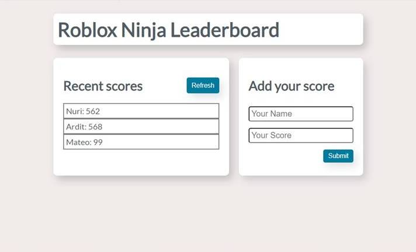

# LEADER BOARD

> Microverse project on practcing gitflow, HTML, CSS and Javascript.



Additional description about the project and its features.

## Built With

- HTML
- CSS
- JAVASCRIPT
- Node.js/NPM


## Getting Started

```
npm install
npm run build
npm start
```

## Authors

👤 **Author**

- GitHub: [@Nuri1977](https://github.com/Nuri1977)
- Twitter: [@Lackanuri](https://twitter.com/LackaNuri)
- LinkedIn: [@nurilacka](https://www.linkedin.com/in/nuri-lacka-7141b01ba/)


## 🤝 Contributing

Contributions, issues, and feature requests are welcome!

Feel free to check the [issues page](../../issues/).

## Show your support

Give a ⭐️ if you like this project!

## Acknowledgments

- Hat tip to anyone whose code was used
- Inspiration
- etc

## 📝 License

This project is [MIT](./MIT.md) licensed.